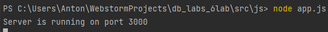
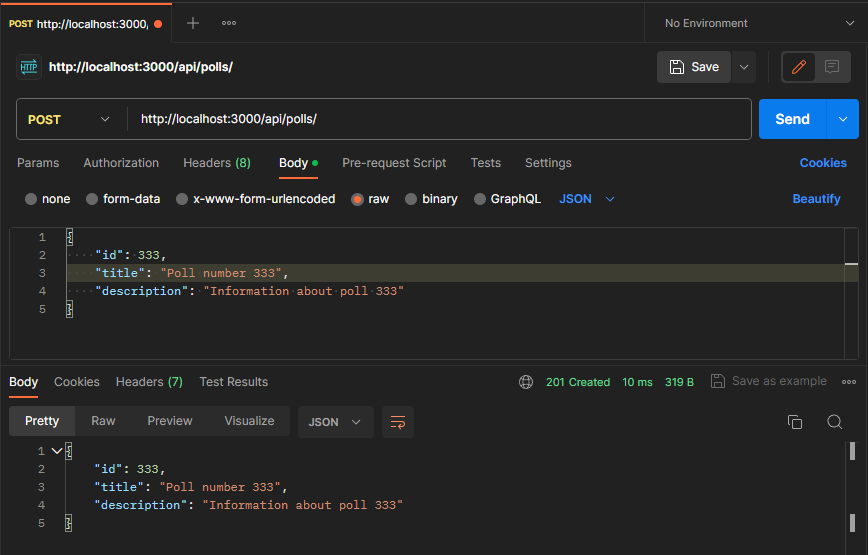
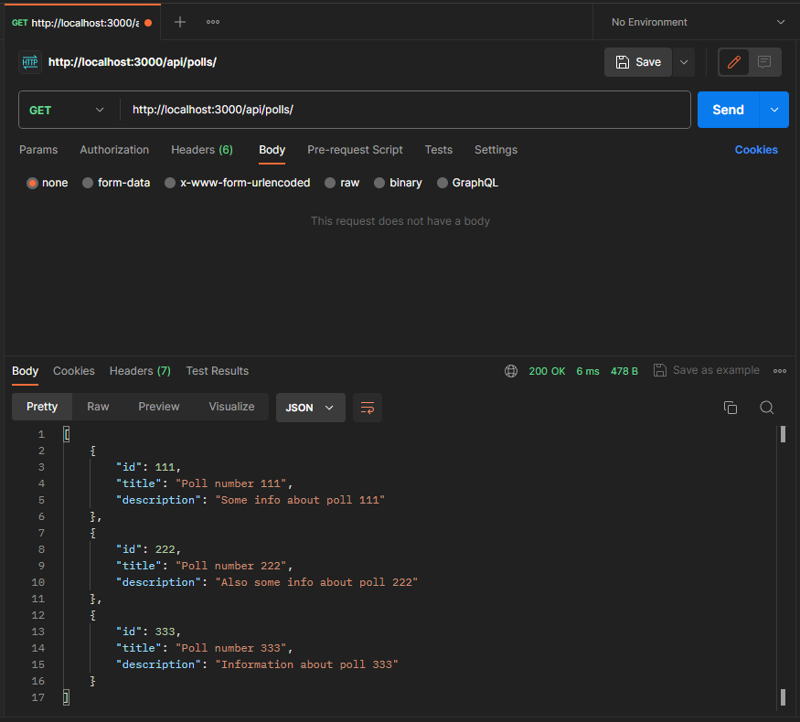
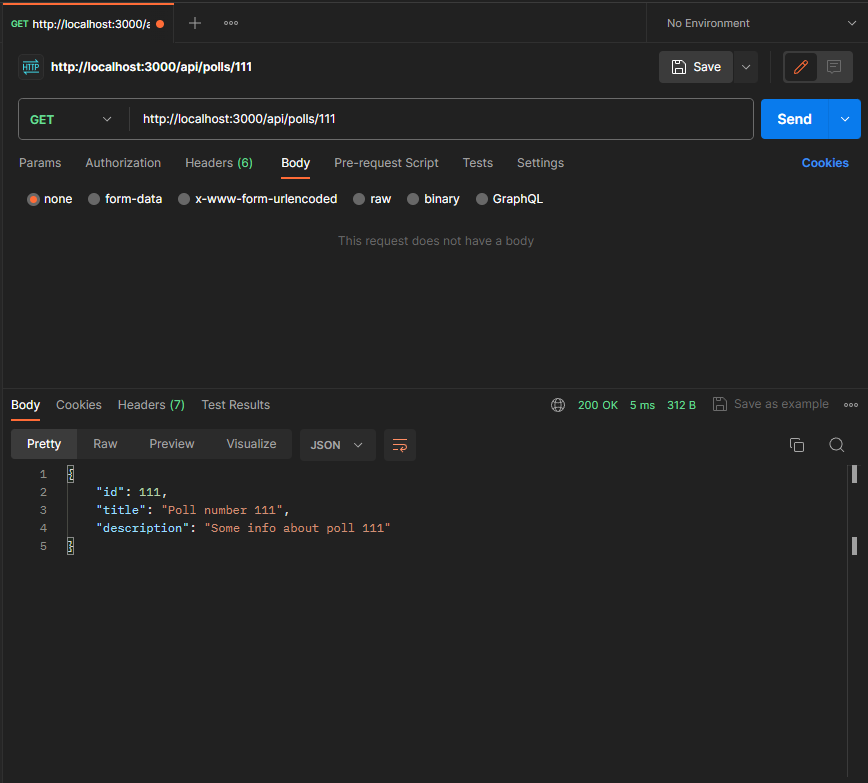
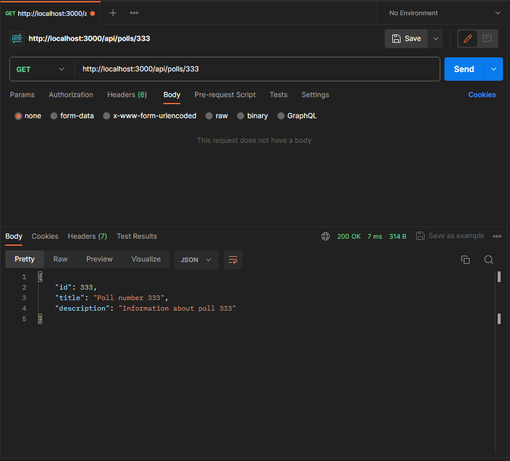
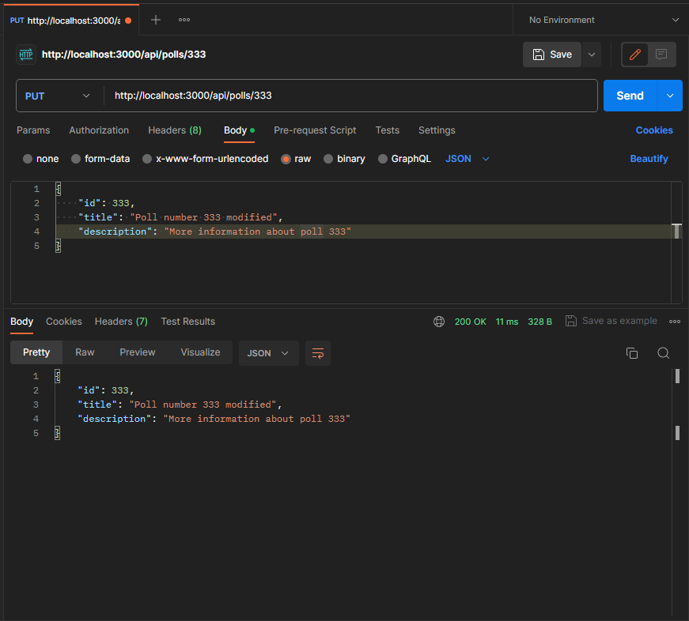
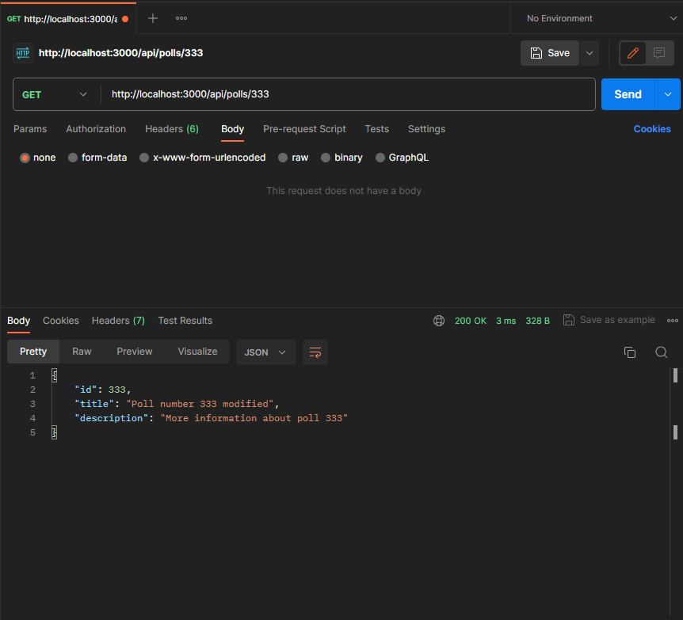
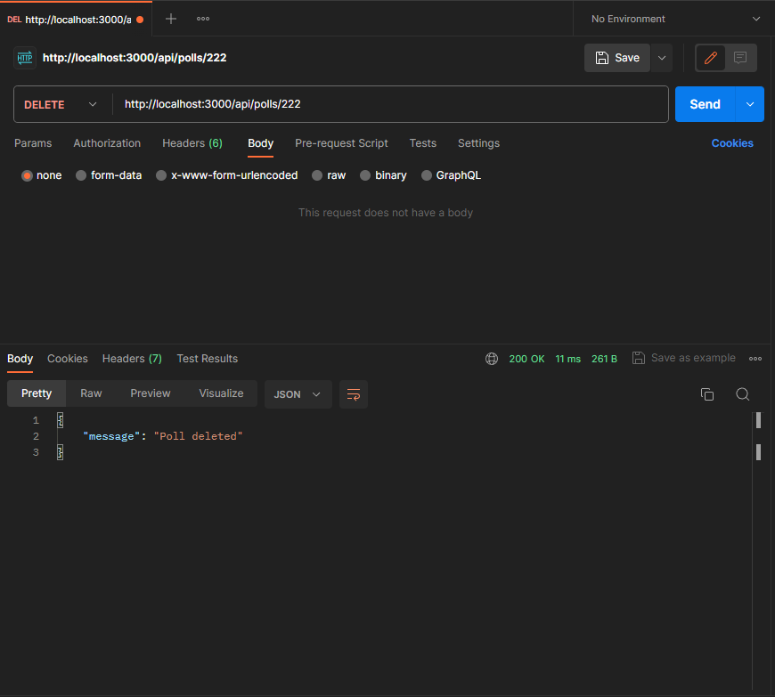
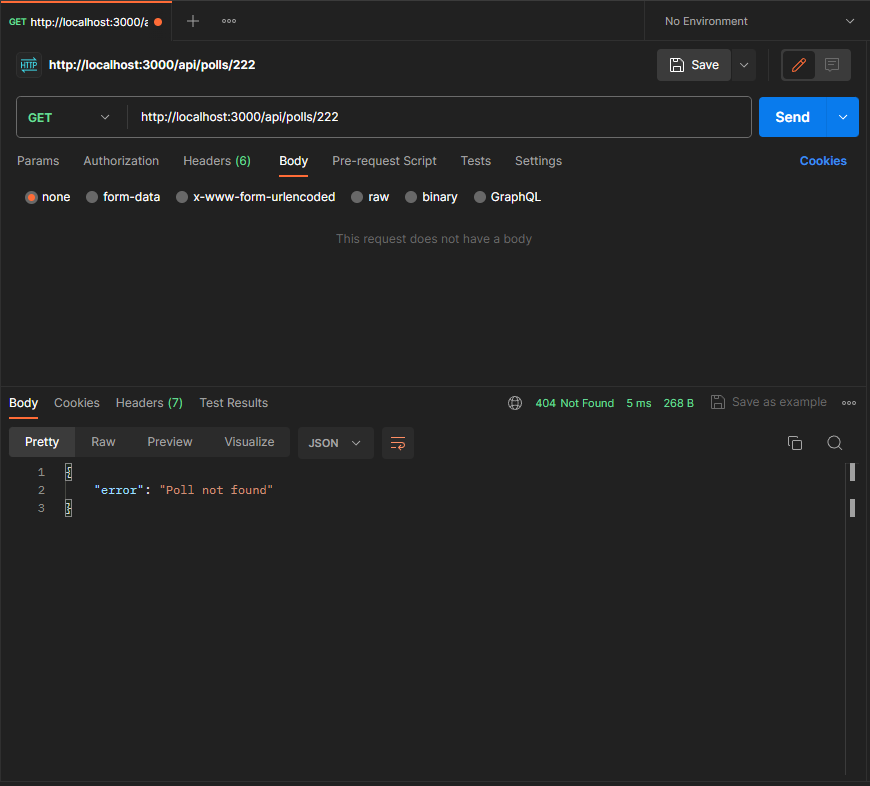

# Тестування працездатності системи

## Старт

## Створення опитування

## Отримання списку всіх опитувань

## Пошук опитування за ідентифікатором

## Оновлення даних опитування

## Видалення опитування

